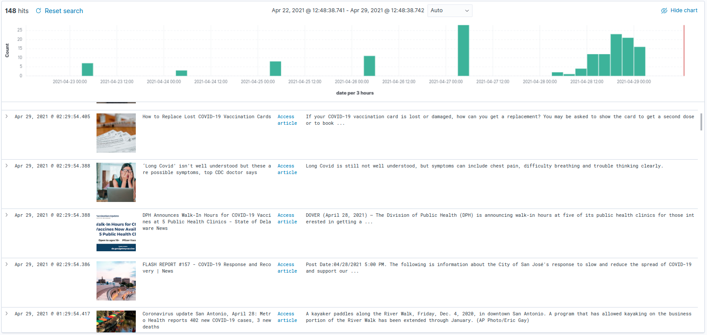
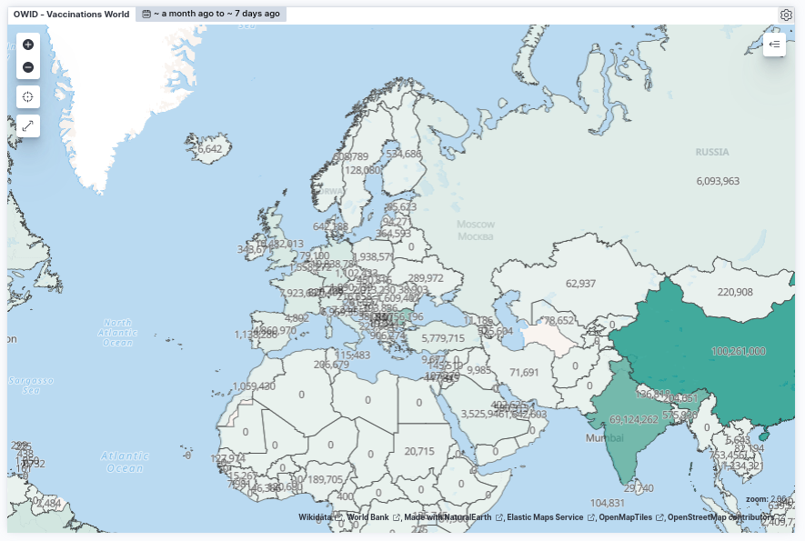

# Pandemic-Knowledge


<p align="center">
    <a href="https://travis-ci.com/flavienbwk/Pandemic-Knowledge" target="_blank">
        
    </a>
    <a href="https://github.com/psf/black"></a>
    <a href="./LICENSE"></a>
</p>

A fully-featured multi-source data pipeline for continuously extracting knowledge from COVID-19 data.

- Contamination figures
- Vaccination figures
- Death figures
- COVID-19-related news (Google News)

## What you can achieve

|                        Live contaminations map + Latest news                        |                   Last 7 days news                    |
| :---------------------------------------------------------------------------------: | :---------------------------------------------------: |
|  |  |

|            France 3-weeks live map (Kibana Canvas)            |                     Live vaccinations map                     |
| :-----------------------------------------------------------: | :-----------------------------------------------------------: |
|  |  |

## Context

This project was realized over 4 days as part of a MSc hackathon from [ETNA](https://etna.io), a french computer science school.

The incentives were both to experiment/prototype a big data pipeline and contribute to an open source project.

## Install

Below, you'll find the procedure to process COVID-related file and news into the Pandemic Knowledge database (elasticsearch).

The process is **scheduled** to run every 24 hours so you can update the files and obtain the latest news

- [Pandemic-Knowledge](#pandemic-knowledge)
  - [What you can achieve](#what-you-can-achieve)
  - [Context](#context)
  - [Install](#install)
    - [Env file](#env-file)
    - [Initialize elasticsearch](#initialize-elasticsearch)
    - [Initialize Prefect](#initialize-prefect)
    - [Run Prefect workers](#run-prefect-workers)
    - [COVID-19 data](#covid-19-data)
    - [News data](#news-data)
    - [News web app](#news-web-app)

### Env file

Running this project on your local computer ? Just copy the `.env.example` file :

```bash
cp .env.example .env
```

Open this `.env` file and edit password-related variables.

### Initialize elasticsearch

Raise your host's ulimits for ElasticSearch to handle high I/O :

```bash
sudo sysctl -w vm.max_map_count=500000
```

Then :

```bash
docker-compose -f create-certs.yml run --rm create_certs
docker-compose up -d es01 es02 es03 kibana
```

### Initialize Prefect

Create a `~/.prefect/config.toml` file with the following content :

```bash
# debug mode
debug = true

# base configuration directory (typically you won't change this!)
home_dir = "~/.prefect"

backend = "server"

[server]
host = "http://172.17.0.1"
port = "4200"
host_port = "4200"
endpoint = "${server.host}:${server.port}"
```

Run Prefect :

```bash
docker-compose up -d prefect_postgres prefect_hasura prefect_graphql prefect_towel prefect_apollo prefect_ui
```

We need to create a _tenant_. Execute on your host :

```bash
pip3 install prefect
prefect backend server
prefect server create-tenant --name default --slug default
```

Access the web UI at [localhost:8081](http://localhost:8081)

### Run Prefect workers

Agents are services that run your scheduled flows.

1. Open and optionally edit the [`agent/config.toml`](./agent/config.toml) file.

2. Let's instanciate 3 workers :

  ```bash
  docker-compose -f agent/docker-compose.yml up -d --build --scale agent=3 agent
  ```

  > :information_source: You can run the agent on another machine than the one with the Prefect server. Edit the [`agent/config.toml`](./agent/config.toml) file for that.

### COVID-19 data

Injection scripts should are scheduled in Prefect so they automatically inject data with the latest news (delete + inject).

There are several data source supported by Pandemic Knowledge

- [Our World In Data](https://ourworldindata.org/coronavirus-data); used by Google
  - docker-compose slug : `insert_owid`
  - MinIO bucket : `contamination-owid`
  - Format : CSV
- [OpenCovid19-Fr](https://github.com/opencovid19-fr/data)
  - docker-compose slug : `insert_france`
  - Format : CSV (download from Internet)
- [Public Health France - Virological test results](https://www.data.gouv.fr/en/datasets/donnees-relatives-aux-resultats-des-tests-virologiques-covid-19/) (official source)
  - docker-compose slug : `insert_france_virtests`
  - Format : CSV (download from Internet)

1. Start MinIO and import your files according to the buckets evoked upper.

    For _Our World In Data_, create the `contamination-owid` bucket and import the CSV file inside.

    ```bash
    docker-compose up -d minio
    ```

    > MinIO is available at `localhost:9000`

2. Download dependencies and start the injection service of your choice. For instance :

    ```bash
    pip3 install -r ./flow/requirements.txt
    docker-compose -f insert.docker-compose.yml up --build insert_owid
    ```

3. In [Kibana](https://localhost:5601), create an index pattern `contamination_owid_*`

4. Once injected, we recommend to adjust the number of replicas [in the DevTool](https://localhost:5601/app/dev_tools#/console) :

    ```json
    PUT /contamination_owid_*/_settings
    {
        "index" : {
            "number_of_replicas" : "2"
        }
    }
    ```

5. Start making your dashboards in [Kibana](https://localhost:5601) !

### News data

There are two sources for news :

- Google News (elasticsearch index: `news_googlenews`)
- Tweeter (elasticsearch index: `news_tweeter`)

1. Run the Google News crawler :

  ```bash
  docker-compose -f crawl.docker-compose.yml up --build crawl_google_news # and/or crawl_tweets
  ```

2. In Kibana, create a `news_*` index pattern

3. **Edit** the index pattern fields :

  | Name | Type                                                  | Format  |
  | ---- | ----------------------------------------------------- | ------- |
  | img  | string                                                | **Url** |
  | link | string **with Type: Image** with empty _URL template_ | **Url** |

4. Create your visualisation

### News web app

Browse through the news with our web application.


1. Make sure you've accepted the self-signed certificate of Elasticsearch at [`https://localhost:9200`](https://localhost:9200)

2. Start-up the app

    ```bash
    docker-compose -f news_app/docker-compose.yml up --build -d
    ```

3. Discover the app at [`localhost:8080`](http://localhost:8080)

---

<details>
<summary>TODOs</summary>

Possible improvements :

- [ ] [Using Dask for parallelizing](https://docs.prefect.io/core/idioms/parallel.html) process of CSV lines by batch of 1000
- [ ] Removing indices only when source process successfuly worked (adding new index, then remove old index)

</details>

<details>
<summary>Useful commands</summary>

To stop everything :

```bash
docker-compose down
docker-compose -f agent/docker-compose.yml down
docker-compose -f insert.docker-compose.yml down
docker-compose -f crawl.docker-compose.yml down
```

To start each service, step by step :

```bash
docker-compose up -d es01 es02 es03 kibana
docker-compose up -d minio
docker-compose up -d prefect_postgres prefect_hasura prefect_graphql prefect_towel prefect_apollo prefect_ui
docker-compose -f agent/docker-compose.yml up -d --build --scale agent=3 agent
```

</details>
